# HUSHFALL: look assessment (the brutal version)

2026-10-06. Requested by the owner: *"be brutal and assess the look of everything we have created. What is keeping it looking like AI slop? What can we do to make it not be anything close to slop worthy? ... this should be zombie/alien."*

Every picture below was captured today from the current build, on one machine, in the same conditions (1280x720, software GL). No game code was changed to make them. Images are in `review/assessment/`. How to redo them is at the bottom.

**What this is not:** I looked at stills. I did not judge animation, motion or sound. "Slop" is a judgement, not a measurement; where I could measure something I say so, and where I am giving an opinion I say that too. Most of the content in these frames was built by me, as parametric recipes, to get maps through gates quickly, so this is also an assessment of my own defaults.

---

## 1. The verdict

**The renderer is a real style. The content drawn through it is not designed yet.**

The ink outline, the banded colour, the paper grain and the low-res upscale give the game a coherent, recognisable surface. That part is good and is what you said you love. But underneath it, almost everything is a *default*:

- one body in five hats (the "zombies"),
- a pink egg and a neon wireframe ball (the "aliens"),
- one texture recipe on every surface,
- one rectangular room re-skinned across Episode 2, and boxes almost everywhere else,
- a pink-orange-purple dusk with teal on top, which is the stock look of generated imagery.

The look was approved on a demo that had **placeholder content** (a yellow coat and a pink egg). That placeholder content was then scaled to 18 maps. Compare the approved demo with the current build:

| the approved look demo (2026-09-29) | the current build, Episode 2 |
|---|---|
| 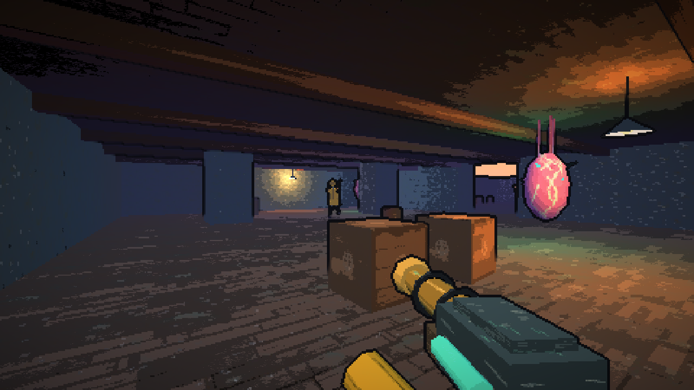 | 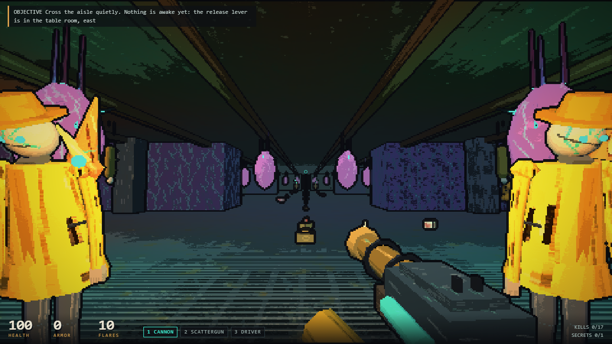 |

Same coat, same egg. The demo had something the build mostly lost: **pools of warm light on dark walls** and real depth. The content was copied; the mood was not.

---

## 2. What is good (protect this)

- **The post pass.** Ink outline + value banding + paper grain make cheap geometry look drawn. Everything below depends on keeping it.
- **Port Marrow at dusk** (Episode 1 exteriors): readable, warm against cool, a real place.
- **Pockets of atmosphere**: a lit brick corridor with a lamp pool and an ember river; a dark hall that only your lamp reveals.
- **Gameplay readability**: enemies pop against the level. The Gaunt Runner is the one creature that already looks like a *creature*.
- **The rime vault** (Episode 2 secret): the clearest case of a material (pale cold tile) that makes a room read as its own place.

| Port Marrow market | the ember strip, Kiln | Marrow Quay |
|---|---|---|
| 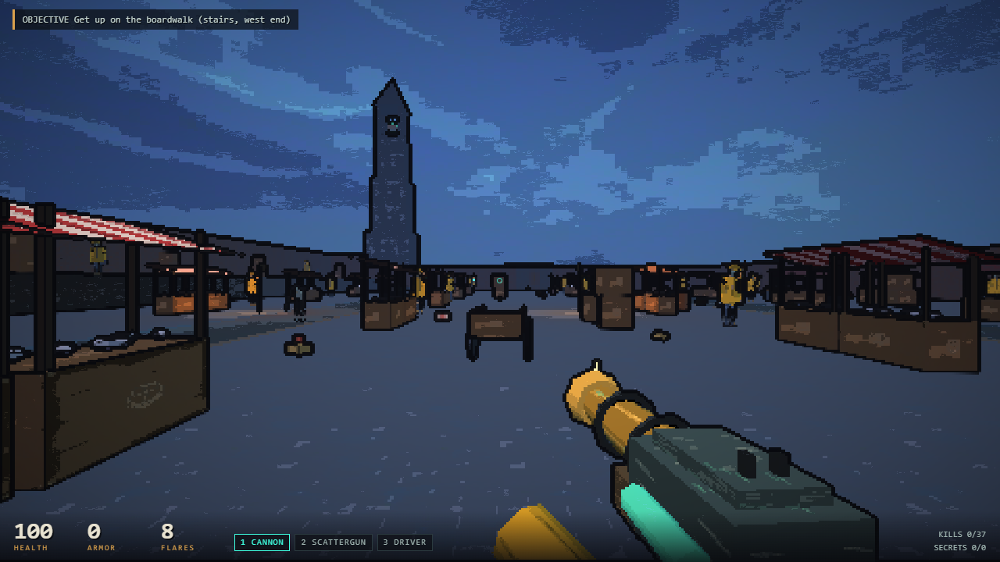 | 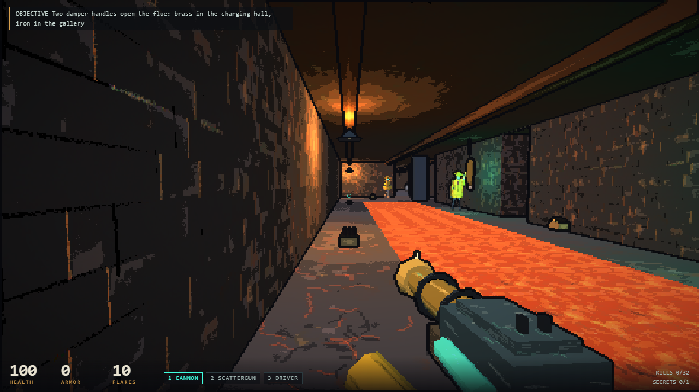 | 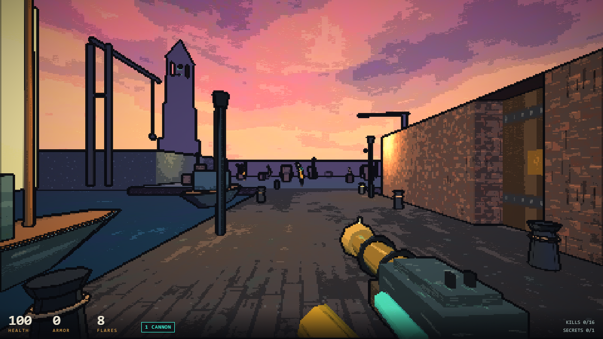 |

---

## 3. What is keeping it looking like slop, worst first

### S1. The zombies are not zombies: five creatures, one body

The Tollbearer, Bellhand, Sexton, Warden-Graft and Cantor are all built by the same function (`makeTollbearer(atlas, variant)` in `src/render/models.js`, wired in `src/render/view.js`). The code comment says it plainly: *"the same rig, different silhouettes"*, in the same sentence as *"a new enemy is a new shape, not a recoloured sprite"*. The Tollbearer, Bellhand and Sexton differ by a hat and a prop.

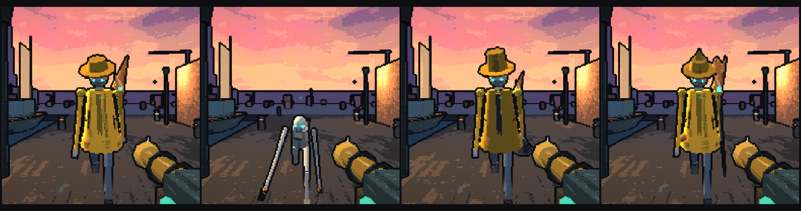

I measured it: same spot, same distance, same pose, the creature's pixels against an empty frame, overlap = intersection over union.

| pair | silhouette overlap |
|---|---|
| Tollbearer / Sexton | **0.87** |
| Tollbearer / Bellhand | **0.82** |
| Bellhand / Sexton | **0.79** |
| any of those three / Gaunt Runner | 0.25 to 0.33 |
| any of those three / Drone-Gill | 0.27 to 0.30 |

(Rough method: thresholded frame difference, cleaned; good enough for a ratio of 0.8 against 0.3, not a precise number. `tools/dev/silhouettes.mjs`.)

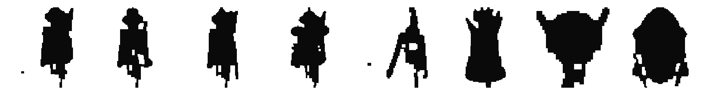

Left to right: Tollbearer, Bellhand, Sexton, Warden-Graft, Gaunt, Cantor, Drone-Gill, Graft-Mother. The first four are one shape. The pillars of the old-school genre are *silhouette readability* and *a memorable enemy per slot*; four of the eight are the same cut-out.

And the design itself is wrong for what you asked for. Look at the close-up:

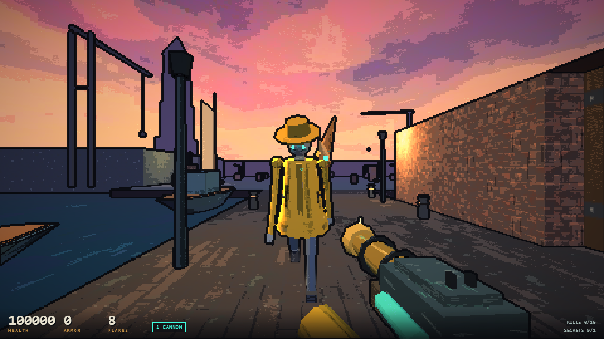

This is a person in a **bright yellow rain slicker and a sun hat** with glowing eyes and a spike on the back. It reads as a fisherman cosplay, a toy, a mascot. There is no decay, no wound, no skin, no wrongness. The "graft" (the idea that makes them Tollbearers: bell-chitin grown out of a captured human) is a single orange cone on one shoulder. Arms and legs are rigid tubes. Nothing here says *this person was a person and is being turned into something*. It is the loudest colour on screen in every frame, spent on the enemies.

### S2. The "aliens" are a cliché kit, and not the aliens in your own design doc

`GAME_VISION.md` describes the Vael as *a fungal-crystalline choir-civilisation harvesting nervous systems as living tuning forks*, with captured humans hung in **cradles** and grafted with bell-chitin. That is a strong, specific, creepy idea. What is drawn:

- **a pink egg** (the cradle, the feeder, the Graft-Mother's body, the "pod" props),
- **a purple/pink orb with one big eye and little legs** (Drone-Gill),
- **a neon teal wireframe geodesic sphere** (every shield),
- **cyan zigzag lightning** (every wall of Vael growth).

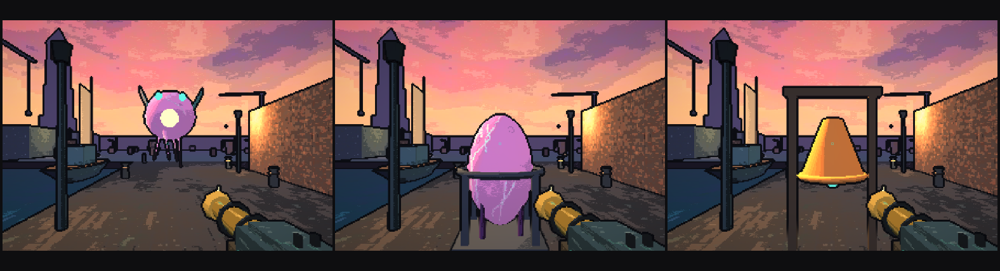

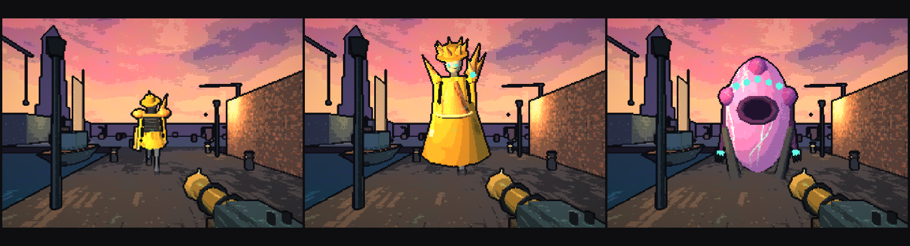

The Drone-Gill reads as a cute balloon pet. The Graft-Mother, the Episode 2 boss, reads as **a pink Easter egg with a mouth**. The Cantor, the Episode 1 boss, reads as **a golden gown with a crown**. These are not frightening and they are not alien. They are what a generator draws when asked for "alien": an egg, a glow, a crackle.

Worst of all, the strongest image in your lore, **people hanging in cradles**, is shown as pink eggs on the ceiling, with no person in them. The horror is in the text and not in the pixels.

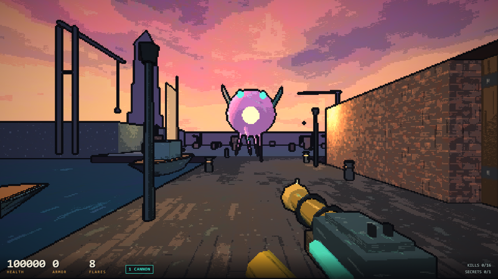

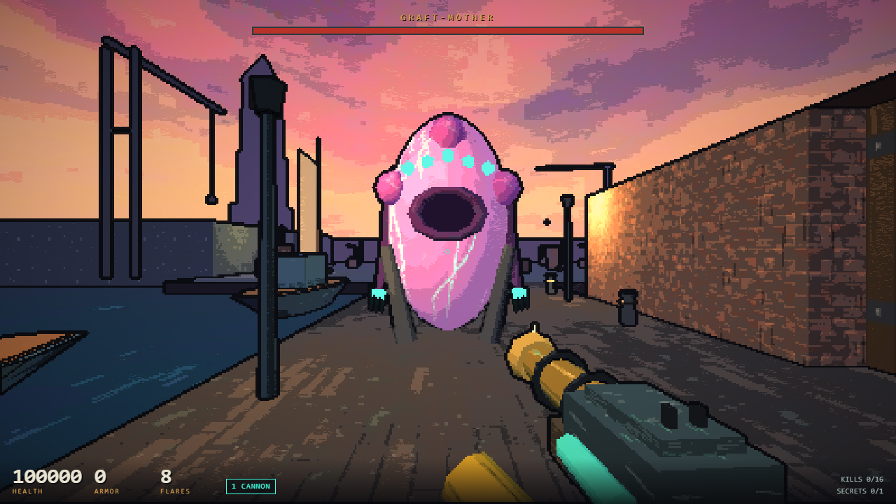

### S3. One texture recipe for every surface

The 28 baked wall, floor and crate textures (sheeted below) share one recipe: a flat base colour, translucent cloud blotches, a few short dash scratches, tiny rivet circles, varied only in colour and layout. Brick, plaster, steel, timber, slate and "alien resin" are the same marks in different colours.

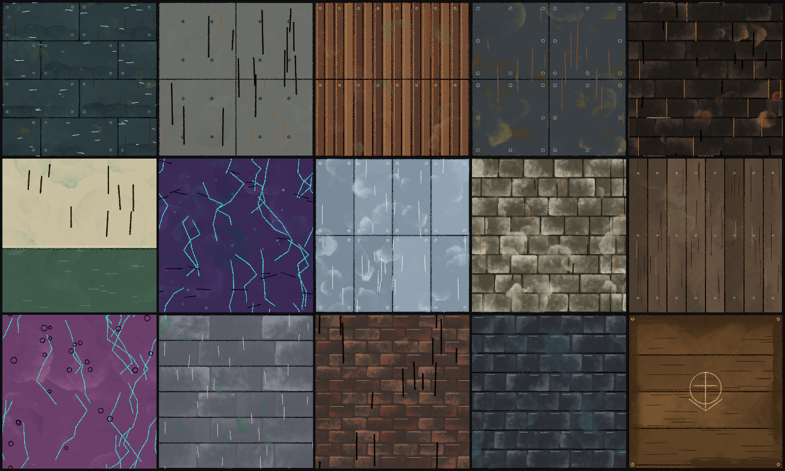

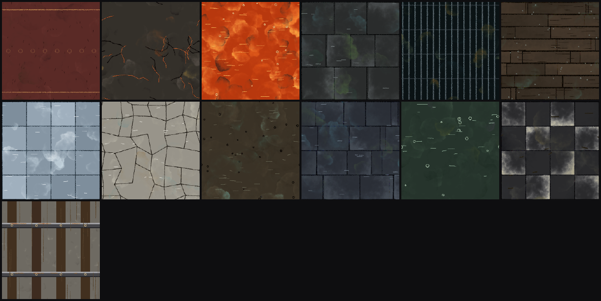

The two alien materials (`wall_resin_a`: second row, second from left, on the walls sheet; `pod_organic_a`: bottom row, far left) are literally **purple or magenta with cyan zigzags added**. In the game that becomes wallpaper:

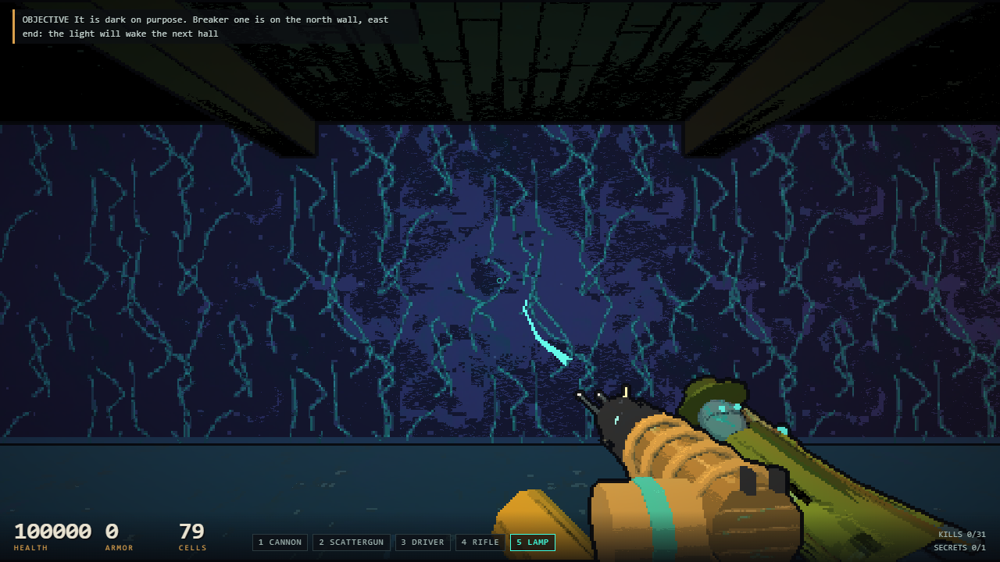

A wall of growth should have relief, a front where it spreads, a wet highlight, depth. This is a flat sheet. (Lit by the lamp it looks like a wallpaper from a 1990s sci-fi game.)

### S4. One room, re-skinned (and boxes everywhere else)

Almost every space is rectangles: rectangular rooms, rectangular pillars, flat ceilings with beams, doors in the middle of walls. Episode 1 varies more (a quay, a market, a tower, a courtyard). Episode 2 is where it shows, and the "alien environment" is the same box with a different wallpaper. This is the arrival view of the eight Episode 2 maps:

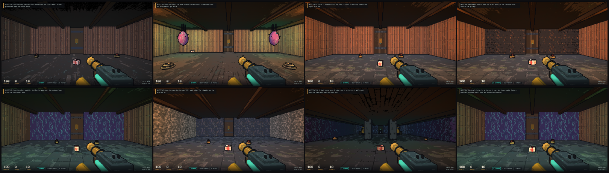

It is the same room eight times: same door in the middle of the far wall, same pickup spots, same ceiling beams. Only the wall material changes. The alien rooms (below) are the same thing:

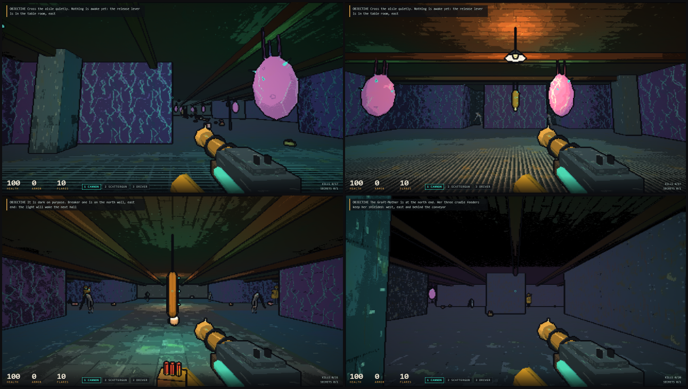

And the big spaces are big flat planes:

| E1M05 terraces | E2M02 salt pans | E2M03 rail shed |
|---|---|---|
| 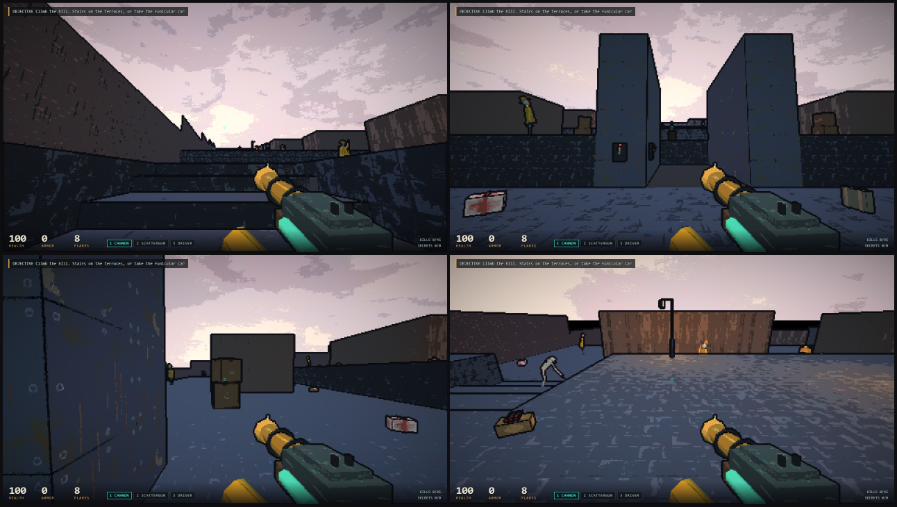 | 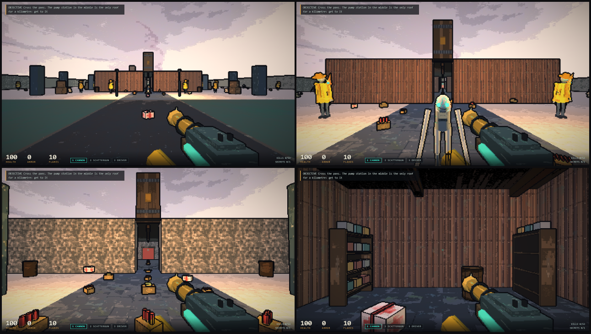 | 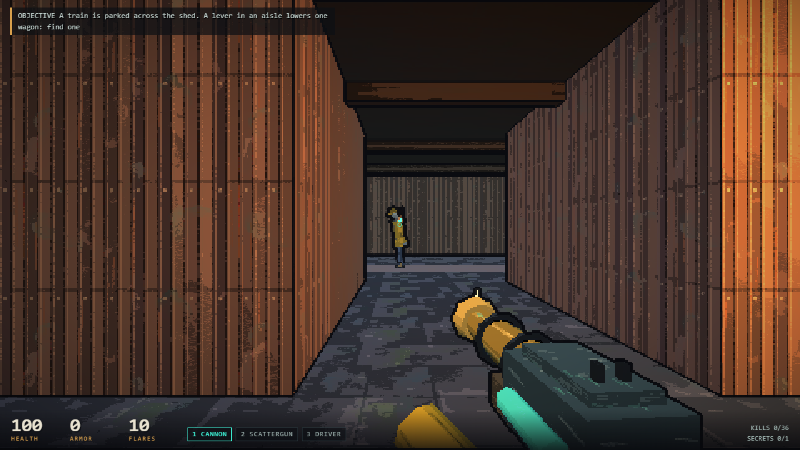 |

Whole frames are one wall texture. Nothing curves, leans, droops, branches or changes scale. Aliens do not build in rectangles; the sim being a grid is no excuse for the picture being one.

### S5. The palette is the default, and teal means everything

- The sky is a **hot pink / orange / purple dusk gradient** with teal accents. That is the single most generic image signature there is.
- **Teal** is the HUD crosshair, the weapon glow, every enemy's eyes, every shield, the lamp's lightning and the wall cracks of alien growth. A colour that means everything means nothing.
- **Yellow/brass** is the weapons, the glove, and the coat of every human enemy. Same problem.
- There is no colour script per episode. Episode 2 (the Salt Works) should feel bleached and chemical; it feels like Episode 1 with brown walls.

### S6. The light is flat

`src/render/view.js` lights the world with one hemisphere light, one directional light, a few point lights and fog, on Lambert materials. I checked: there is **no shadow map anywhere in the renderer**. Actors have no contact shadow, walls have no light pools except around the few lamps, and in my judgement most frames are evenly lit. The approved demo had warm pools and dark falloff (see the demo frame above); the maps lost it. The dark maps look good *because they are dark*, not because the lighting is designed.

### S7. The world has no memory

There is no decal, blood or gib code in `src/` (a search finds nothing). Shots throw chips of debris; in the census frames a dead creature is a small crumpled shape. Nothing you do leaves a mark, and nothing was done to the world before you arrived: no stains, no dragged things, no growth front crossing a human wall, no body shapes in the cradles. The pillar *"environment tells the story"* is told by the objective box in the corner, not by the picture.

### S8. Weapons: props held by the same yellow glove

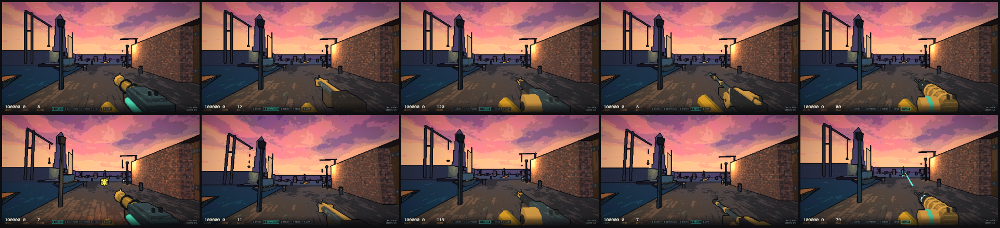

Top: the five guns at the hip. Bottom: while firing. Three of them (scattergun, rivet driver, harpoon rifle) are thin dark-gunmetal sticks with a few brass parts, sitting low in the right of the frame; the flare cannon and the lamp are chunkier brass. All five are held by the **same big yellow glove and sleeve**, which is the loudest thing in the frame. Teal turns up on most of them as the accent. Only the lamp has a clearly different silhouette. They read as props, not tools with mass and history: a scattergun, a rivet driver, a whaling harpoon and a lamp should look made from different materials by different hands.

### S9. The shell is a developer's page

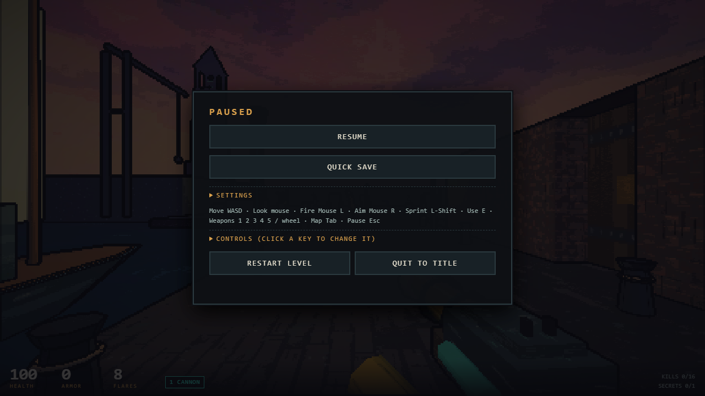

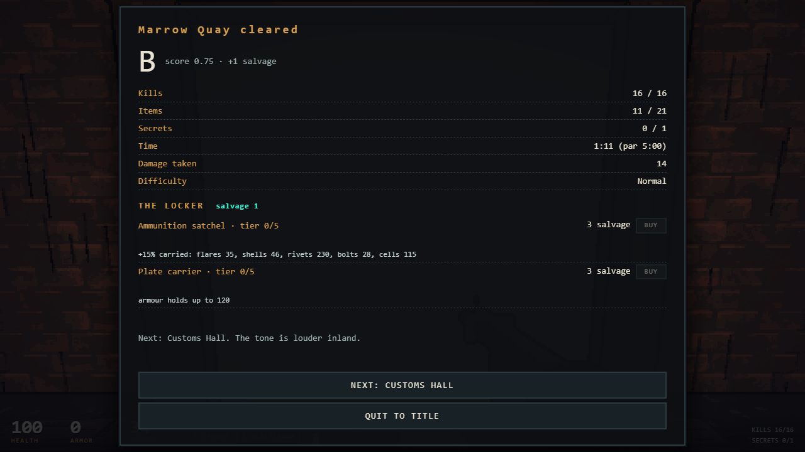

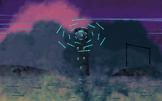

Dark monospace panels with default buttons; the "Locker" is a spreadsheet; the title art (320x200) is a smudge you cannot read. This is fine for a dev build and is not a game's front end. The HUD numerals are the one good piece.

---

## 4. Why this happened (so it does not happen again)

1. **The look gate approved a renderer, and then content was scaled with no art-direction step.** There is no concept stage, no turnaround sheet, no creature silhouette sheet, no per-episode palette. Content went from a one-line brief straight to code.
2. **Parametric content is consistent by construction, and that is exactly the failure mode.** Recipes produce the same marks, the same box, the same body. Consistency is good for gates; it is what slop is made of.
3. **Our gates measure what machines can measure.** Routes, hashes, hit volumes, the render-truth census: all genuinely valuable, and none of them asks *does this frame look designed*. 68 maps could pass all of them and still be one room.
4. **"Alien" was solved by decoration**: pink, glow, crackle. The design doc was richer than the build and nobody checked one against the other.

---

## 5. Recommendations

Principle: **keep the renderer and the painted/ink language; replace the content, in a proof-then-roll-out sequence like the rest of this project.** Nothing below needs a new engine.

### R1. Redo the creatures (biggest change, do first)

**Human side, the Tollbearers.** *A person becoming an instrument.*
- Take the yellow slicker away as the hero colour. Dark, sodden, torn clothing; pale grey-green skin with bruise-violet; the neck and spine **cabled** with grown bell-chitin that has not finished growing (bronze and bone, wet, uneven). Head tilted as if listening; mouth slack and slightly open (it is resonating); eyes milky with one cold teal point (the only teal on the body).
- Posture and gait: forward slump, one arm longer or dragging, head lagging the body. A part kit (3 heads × 3 coats × 2 graft stages) makes a *crowd* that is not clones.
- **Every kind gets its own rig and silhouette**, tested: Bellhand with one arm replaced by a bell-bronze hypertrophied limb; Sexton tall and stooped with a staff; Warden-Graft a hulk with armour *grown into* the body, not a man in plate; the Cantor a tall bell-bodied thing with a ring of resonator petals, not a gown.
- Yellow is for survivors and lanterns (hope). The player learns "yellow = friend, safe, light".

**Vael side.** *Grown, not built; like bells, flowers and organ pipes.*
- Shape language: vertical symmetry, tubes and pipes, bell-shaped membranes, branching crystal, ribbing. Colour: bone-white + bruise-violet + wet lacquer highlights, with **slow bioluminescent veins pulsing at one fixed tempo (the Hush)**. Teal is their *voice* only.
- **Drone-Gill**: a translucent bell/jellyfish with a fringe of gills, trailing tendrils, a glowing core seen through the membrane; no cartoon eye.
- **Cradle**: a membrane sac with **a human shape inside**. This single change puts the best image in the lore on screen.
- **Graft-Mother**: not a monster standing in a room; a **room-sized organism**: a ribbed vault, a conveyor of cradles feeding a vertical throat, the body *is* the architecture. The shield becomes a **resonance field** (concentric standing-wave rings that open like petals), not a wireframe ball.

### R2. Real material families, and decals

- Three families built with *different recipes*, not different colours: **built-human** (with wear that has a cause: water streaks under sills, rust at fasteners, plaster lost to show brick), **Vael-grown** (relief, nodules, veins, translucency, wet highlight) and **hybrid** (growth crossing a human surface with a visible front).
- A separate **decal sheet** baked in p5.brush: growth fronts, drips, scorch, bell sigils, hand-drawn marks, chalk. Placed by the map author at story points.
- Bake macro structure (gradients, stains, shading) *into* textures. The big flat planes are where most of the frame is.

### R3. Break the rectangle (without breaking the sim)

The simulation stays a grid; the picture does not have to. An **alien kit** of scenery meshes that *dresses* the rectangular rooms: ribbed arches across ceilings, bulging membrane walls, root columns, drooping sacs, floor channels, scale jumps. Rules to keep sim and picture in agreement: cladding stays inside cell boundaries or wall thickness, and the render-truth census and hit-volume tests must pass. Also: ceilings that vary, sloped floors in alien rooms, and at least one genuinely different space per map.

### R4. A colour script, with meaning

- One page per episode: **3 hues + 1 accent**. Episode 1 keeps the harbour dusk (earned); Episode 2 goes bleached salt, rust and chemical green-teal; Episode 3 bone, ivory, violet; Episode 4 black and cold.
- **Teal = the Vael and the Hush, nothing else** (move the HUD and weapon accents to other colours). **Yellow = survivors and lamplight.**
- Replace the generic pink sky as the default; pink is for one hour of one episode.

### R5. Light it like the approved demo

Warm light pools on dark walls (the demo had them), baked ambient occlusion in vertex colour, cheap blob shadows under actors, light shafts and low fog layers, **Vael light that pulses at the Hush tempo**, and darkness as the default in alien areas. Budget test first: the browser check already tracks render cost.

### R6. Let the world remember

A view-only decal and body system (the renderer already receives hit, kill and impact events): ichor and blood splats, scorch, chips, **bodies that stay** (capped), growth that creeps across a wall the more of it you cleared. This is where "environment tells the story" becomes visible.

### R7. Weapons and hands

Each gun from its own materials and silhouette (worn walnut and gunmetal; riveted sheet iron; whaling ironwork with rope; glass and copper), bigger and heavier in frame, real arms/hands instead of the single yellow glove, idle sway, ejected shells, a proper muzzle read.

### R8. Paint the front end

Painted panel frames and a painted title in p5.brush, the Locker as a pinned-up painted board, keep the HUD numerals.

### R9. Guardrails so slop cannot come back

- **Silhouette test** (built: `tools/dev/silhouettes.mjs`): any two creatures that can appear together must overlap < 0.5.
- **Arrival-frame uniqueness**: no two maps' first frames within a set distance of each other.
- **Palette audit** per map (dominant hues, teal share against the colour script).
- **Recipe audit**: no two material families share a generator.
- **Look gate**: a new creature, material family or episode skin needs an owner-approved board (silhouette thumbnails, palette, one painted frame) *before* it is built.

### Suggested order

| step | what | needs |
|---|---|---|
| **L0** | **Look bible v2**: creature turnarounds and silhouettes (baked from p5, no engine code), a palette script per episode, the three material families, the alien kit shapes. Design only. | owner approves |
| **L1** | **One proof**: one human zombie, one Vael creature, one alien room fragment, the three material families for Episode 2; the same shot list as this document, before and after. | owner approves |
| **L2** | Roll out to the ten existing creatures and re-skin the Episode 1 and 2 maps; one evidence regeneration for all 18. | |
| **L3** | Decals and bodies, lighting pass, weapons and hands, the front end. | |

**Cost to know up front:** all of this changes `render/` and `assets/`, which invalidates the real-game evidence of every one of the 18 maps. That is the existing rule, not a new one: I will batch it so there is *one* full regeneration per step and not one per tweak. Nothing here changes the simulation, the routes or the balance.

**What I would not do:** start by hand-tuning textures. The sameness is not in the numbers; it is in the designs. Fix creatures first (S1, S2), then materials and shapes (S3, S4), then mood (S5, S6).

---

## 6. The decision I need from you

Approve **L0** (design only, no engine code, no evidence regeneration, nothing in the game changes) and I will produce the look bible v2 for your approval, one creature at a time, starting with the Tollbearer and the Cradle. Or tell me the order you want.

---

## Appendix: method, limits, how to redo it

- Captures: 17 maps' vantage sets from `maps-src/<ID>.views.json` (261 frames), every creature near / mid / dead on one spot, five weapons hip and firing, UI screens, all baked textures. I read contact sheets of 15 of the 17 sets; **I did not look at C1E1S01, and for C1E2M01 only at its arrival frame**. Marrow Quay (C1E1M01) has no view list; its frames come from the same spot the weapons shots use.
- The corpse frames from the new capture were inconclusive (the "dead" pose I forced is not what a kill produces), so I make no claim about death animation. Only that corpses are small crumpled shapes in the census frames.
- The silhouette overlap numbers are a rough thresholded frame difference with cleaning; treat 0.8 versus 0.3 as the finding, not the second decimal.
- Nothing in `src/` or `assets/` was touched: no evidence is stale because of this document.
- Redo: `node tools/dev/shoot-assessment.mjs env|enemies|weapons|ui|sil <outDir>` (frames), `node tools/dev/contact-sheet.mjs` (sheets), `node tools/dev/silhouettes.mjs <dir> <out.png> kind kind ...` (overlap).
