# HUSHFALL look bible v2 ("Tuned")

**Status: L1 BUILT into the game (2026-10-07, see PART C); evidence regeneration and frame time pending. L0 was refined (2026-10-06, the owner: "I want to refine these and make them distinct and fit the game and architecture of the code"). Design tooling only, awaiting the owner's decision.** Nothing in the game changed: no `src/`, `assets/`, map, route or sim file was touched, so no evidence is stale. PART B below is the refinement: the ten creatures rebuilt as REAL rigs in the game's own rig architecture and drawn through the game's own post pass; where Part B and the drawn studies of Part A disagree, Part B is right (it is measured on the built geometry). Everything is under `tools/look/` and `review/look-bible/`, never `assets/baked`.

# PART C: what went into the game (L1, 2026-10-07; read this first, it supersedes Part B where they differ)

**The owner's answer to B8** (2026-10-07): "I trust your decisions Claude. You own it, make sure you are making something you would be proud of." My answers: (1) the 0.50-0.54 humanoid overlap stays as a number and no hit volume moves (an engine change that stales every map's simulation evidence, for a cosmetic reason); the three are separated by hue, prop height, hat and motion instead; (2) per-kind hue: yes, every kind has its own atlas and palette; (3) cost: static parts of each joint are merged and the triangle ceiling is tested; frame time is still to be measured; (4) the Warden-Graft and the feeder were redone before shipping; (5) go, all ten, proven in the real game first.

**What was built.** `src/render/models_choir.js` (the ten rigs), `choir_kit.js` (church bells, tapered tubes, lumpy ball, pleated lathe, ragged strips, joint-wise merging of static parts), `choir_cells.js` (the atlas contract by cell NAME), `tools/baker/recipes_choir.js` (ten p5.brush atlases, `assets/baked/choir_<kind>.png`, about 10 s each), `view.js` (`ENEMY_MODELS` now comes from `models_choir.js`; the Tollbearer's graft grows with the episode: a small bell in Episode 1, the great bell from Episode 2 on; sleepers are posed `awake: false`), `textures.js`, the four rig tests and `measure-rig.mjs` (now on the new rigs), `tests/choir-rigs.test.js` (six new tests). No `defs.js`, engine, `post.js`, audio, map or route file changed.

**A defect in my own Part B, found while building.** A lathe whose profile is written crown-first (top to bottom) is built INSIDE-OUT by three.js (only an ascending-y profile faces outward). Every bell in Part B, in its A/B sheets and the "strongest redesign" bell node among them, was drawn as the far inside wall of a shell: that is why the Tollbearer's bell looked like a funnel and the Bellhand's like a lampshade. The kit now turns profiles round (`tests/choir-rigs.test.js` guards it). The Part B images of bells are therefore not what ships.

| kind | what ships (and what changed from Part B) |
|---|---|
| Tollbearer | an oxblood oilskin coat torn open down the front, hem in strips; a real church bell hung on a rope grown into the right shoulder, swinging at the hip as a pendulum (lags the stride, thrown out by the raised arm); early graft = small bell (Episode 1) |
| Gaunt | pale, long forelimbs, bone claws, red throat, the jaw hangs down; same silhouette, lumpy head |
| Bellhand | the town crier: indigo coat, stovepipe hat with a bronze band, a hand-bell raised beside the head that rings while it is awake (silent asleep), a rope coiled on the hip. (Part B: a collar-bell and a hammer arm; the raised arm read as a trumpet) |
| Sexton | an ivory surplice to the floor, one violet stole, five pipes fanned behind the shoulders like a peacock's tail, a censer on a chain |
| Warden-Graft | redone: a bronze kettledrum grown into the chest with its skin forward, a horned bone mask with one teal slit, iron pauldrons with bronze spikes, it drags two mallets (Part B: a clock-faced chest on a robot) |
| Cantor | a pleated violet bell-robe with ivory rings, fork hands, six church bells orbiting the head |
| Bell node | a tuning fork struck into stone, a real bell floating between the tines, a teal ring |
| Drone-Gill | an engraved ivory dome, ribbon fringe, a hanging heart, a note-bubble; same silhouette |
| Cradle feeder | redone: a cage of six bone ribs round an amber-wrapped captive, head fallen forward, a brass reed grown from the mouth (Part B: a mannequin in a frame) |
| Graft-Mother | redone: a walking church organ, three towers of pipes, a bronze horn off-centre, cradle sacs underneath, four insect legs (Part B: an egg with a crown that read as a face) |

**Measured (2026-10-07).** `node tools/look/check-rigs.mjs`: all ten pass height, width, grounding and root; `node --test` on the five rig test files and `tests/choir-rigs.test.js` passes; in the real game every creature was drawn at 3 m and 8 m in the harbour map with no console error (review stills are not committed: scratch captures). Awake meshes after merging: Tollbearer 26, Gaunt 13, Bellhand 18, Sexton 25, Warden 17, Cantor 27, Bell node 5, Gill 16, feeder 6, Graft-Mother 51 (shipped 6-41); triangles 590-2920 (shipped 220-1100).

**NOT measured or NOT done yet** (say so, do not assume): frame time (`npm run browsercheck` render budget has not been run on these); the silhouette overlap of the NEW humanoids (`tools/look/sil-matrix.mjs` has not been re-run: the hat, the raised bell and the pipe fan are expected to help, that is a hope); animation as motion (stills of walk, tell, strike and death only); in-map look beyond the harbour and two Episode 2 rooms; the evidence of all 18 maps is STALE until regenerated once from a clean commit (`src/render` and `assets/baked` changed); novelty against other games (no survey).

---

# PART B: the refined creatures, built as real rigs (read this first)

**What was built.** `tools/look/rigs_v2.js`: ten factories with the same shape as the shipped `makeTollbearer(atlas)` / `makeDroneGill(atlas)` -> `{ root, rig, pose, mat }`, made with `tools/look/rigkit.js` (the same `atlas()` UV cells, `makeRigGrounder`, one Lambert material per creature, `pose(p)` writes only the rig) on one painted atlas (`tools/look/recipes_proto.js`, p5.brush, 16 cells of 64 px like the shipped atlases). `tools/look/dev.html` draws them through the game's real `PostPass` (ink, banding, paper grain), real entity flagging, the game's lighting recipe, camera (70 degrees) and default 480 px internal width, next to the SHIPPED rigs in the same light (an honest A/B). None of it is in the game.

**The ten, as built** (what changed from the Part A drawings, and why: each change came from a real render or a failing check):

| kind | the refined design | what the real render forced |
|---|---|---|
| Tollbearer (BELL) | lean figure, thin dark coat in strips, a bronze bell grown from the screen-right shoulder (hung to the side and behind), a bone outrigger from the hip, head tilted, mouth open, one teal eye | the bell first hung in front of the chest like a lantern; the chest "ribs" panel read as a paper label (replaced by skin showing through the tear) |
| Gaunt (UNTUNED) | bulky, hunched, pale, long forelimbs with bone claws, a bone ridge down the back, a red throat, the jaw hangs DOWN | the first version was a head on stilts (arms far too long and thin) |
| Bellhand (CLAPPER) | long legs under a short jacket, a tall bell-collar, the hand is a bronze bell-mouth held up beside the head, the other arm a long hammer-limb ending in a clapper | the arm held out front broke the width rule; proportions had to change to separate it from the Tollbearer |
| Sexton (PIPE) | a cone skirt under a narrow body, five pipes fused into a crown, ivory bands | the pipes read as one lantern/pawn shape: distinct, but not a "comb" |
| Warden-Graft (DRUM) | a hunched hulk with a drum on its chest, a three-plate shell on the back, a faceless bone head, huge fists | first version read as a small tin toy with a clock on its chest; drum pulled back inside the hit cylinder |
| Cantor (CHOIR-MASTER) | a bell-shaped robe with ivory rings, fork arms, six bronze bells orbiting the head | the petal halo of Part A read as a flower; replaced by orbiting bells (the choir) |
| Bell node (RESONATOR) | a tuning fork struck into the ground, a bronze bell floating between the tines, a teal ring | the strongest redesign: nothing else looks like it |
| Drone-Gill (GLASS-BELL) | an ivory engraved dome with a ribbon fringe, a hanging heart and spore sac, teal photophores along the rim | opaque, not translucent (a see-through mantle gets no ink outline and no depth) |
| Cradle feeder (SAC) | a wrapped person (head, shoulders, bound arms, tapered feet) hung in a harp frame | the first shroud read as an amphora/bowling pin; arms and a neck added; the frame widened to satisfy the width rule |
| Graft-Mother (ORGAN) | a tall ivory case, nine pipes, a bronze horn OFF-centre and tilted, the cradle sacs hung to one side, four stout legs, grafting arms | with the horn centred and the sacs below it she read as a face with teeth |

## B1. Does it fit the architecture? Measured (`node tools/look/check-rigs.mjs`)

All ten PASS the project's own rules, applied to the true world-space vertices exactly as the shipped rigs are judged (`tests/hit-volume-fair.test.js`, `tests/rig-grounding.test.js`): drawn height within 0.10 m of `defs.js`; the hit cylinder covers 85% of the vertices and is at most 0.15 m wider than the body needs; the lowest vertex stays inside the ground band across every pose family on floors of 0, 0.5, 1 and 3 m (a flyer against its hover); a pose never writes the root. **No `defs.js` value, no hit volume, no engine file needed to change.**

| kind | drawn / defs height | 85%-radius need / have | meshes (new / shipped) | triangles (new / shipped) | asleep, merged to |
|---|---|---|---|---|---|
| tollbearer | 2.33 / 2.25 | 0.41 / 0.45 | 47 / 28 | 1210 / 792 | 3 meshes |
| gaunt | 1.53 / 1.5 | 0.41 / 0.55 | 30 / 23 | 588 / 474 | 2 |
| bellhand | 2.35 / 2.35 | 0.42 / 0.43 | 30 / 31 | 1012 / 960 | 3 |
| sexton | 2.38 / 2.35 | 0.39 / 0.43 | 45 / 33 | 1432 / 930 | 2 |
| wardengraft | 3.01 / 3.0 | 0.59 / 0.60 | 31 / 36 | 1114 / 974 | 3 |
| cantor | 4.75 / 4.8 | 0.82 / 0.85 | 41 / 41 | 1844 / 1100 | 2 |
| bellnode | 2.44 / 2.45 | 0.66 / 0.75 | 9 / 6 | 808 / 220 | 3 |
| gill | 1.14 / 1.15 | 0.62 / 0.65 | 23 / 14 | 1344 / 468 | 3 |
| feeder | 2.05 / 2.1 | 0.65 / 0.75 | 24 / 11 | 1466 / 728 | 3 |
| graftmother | 4.25 / 4.2 | 1.40 / 1.45 | 59 / 31 | 2398 / 1076 | 3 |

The sleeping-enemy merge (`mergeStatic`, one mesh per material) works on every rig (`rigs-asleep.png`): echo shells are never switched with `visible` (a merge would bake them in), they go to a vanishing scale. The cost is real: **about 1.2x to 2.5x the triangles of the shipped rigs and more meshes for the non-humanoids** (a mesh is a draw call while a creature is awake). Not measured: the frame-time effect; `npm run browsercheck` has a render-budget baseline that would show it, and it has not been run on these.

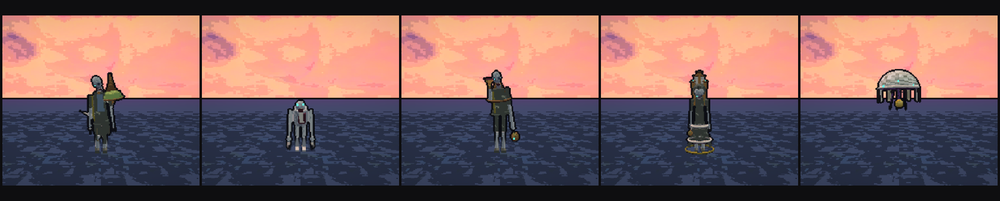

## B2. Are they distinct? Measured on the real geometry (`node tools/look/sil-matrix.mjs review/look-bible/rigs`)

| pair (silhouette overlap, true scale, same distance) | shipped | refined |
|---|---|---|
| Tollbearer / Sexton | 0.86 | **0.52** |
| Tollbearer / Bellhand | 0.91 | **0.54** (0.58 with the early-stage Tollbearer) |
| Bellhand / Sexton | 0.82 | **0.50** |
| Feeder / Bellhand (the egg on a stand, against a man) | 0.54 | 0.29 |
| Cantor / Graft-Mother | 0.65 | 0.27 |
| every other pair of kinds | up to 0.52 | **at most 0.47** |
| my acceptance target | | < 0.50 |

("Shipped" here is measured the same way as "refined", on the shipped rigs' real geometry with `node tools/look/shoot-rigs.mjs sil ... old_<kind>`; the assessment's 0.87 / 0.82 / 0.79 came from a screen-difference method and agree to within 0.05-0.09.)

**I missed my own target on the three humanoid pairs.** In Part A the drawn studies showed 0.49 as the worst pair; the built rigs show 0.54. The reason is physical, not a flaw I can iterate away: the hit radius caps a 2.3 m upright figure at about 0.8 m wide, so three humanoids of the same height share most of their silhouette, and every pull of one mass away from the shared column (a lean, a long arm, a collar) either failed the width rule or moved the overlap by hundredths. What separates the three now is the mass distribution (bell right-top; long legs and a raised bell-hand; a cone skirt and a pipe crown), colour, and motion, not outline alone. If the owner wants the overlap lower, the honest lever is a different hit volume for one of them (an engine change: every map's simulation evidence goes stale), not more geometry.

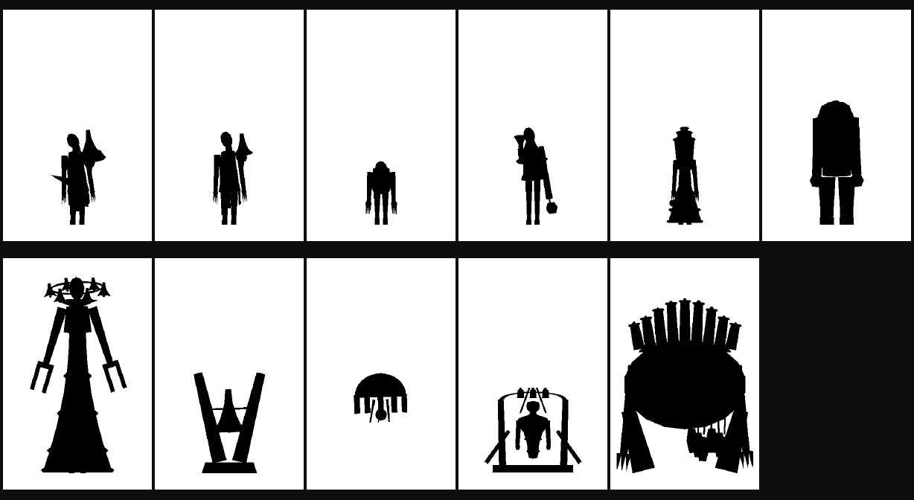

## B3. Can the player see them? Measured (`node tools/look/readability.mjs`)

Mean luminance of the creature against the ring of level behind it, shipped against refined, same light and camera. A larger |dL| = it stands out more.

| | Episode 1 dusk (a bright sky behind): shipped dL -> refined dL | Episode 2 interior (a warm lamp): shipped ratio -> refined ratio |
|---|---|---|
| Tollbearer | -34 -> -32 | 2.23 -> 2.01 |
| Bellhand | -46 -> -33 | 1.93 -> 1.90 |
| Sexton | -33 -> -17 | 2.13 -> 1.81 |
| Gaunt | -1 -> +28 | 1.60 -> 2.27 |
| Warden-Graft | -70 -> -33 | 1.97 -> 2.42 |
| Cantor | -72 -> -84 | 2.21 -> 1.71 |
| Bell node | -72 -> +12 | 1.65 -> 2.62 |
| Gill | -31 -> -33 | 2.56 -> 2.75 |
| feeder | +5 -> -11 | 1.83 -> 1.59 |
| Graft-Mother | -32 -> -19 | 2.05 -> 2.25 |

My worry that dark oilskin would vanish was only partly right: the shipped yellow stood out by HUE, not brightness (its luminance contrast is no better than the refined set's). Weakest in the interior look: the feeder (1.59) and the Cantor/Sexton (1.7-1.8); in the dusk look the Sexton (-17). Hue separation between the three humanoids is now low (all grey-olive skin, dark coat): that is the cheapest lever left (see decisions).

## B4. The ringing tell, the A/B, the lineups

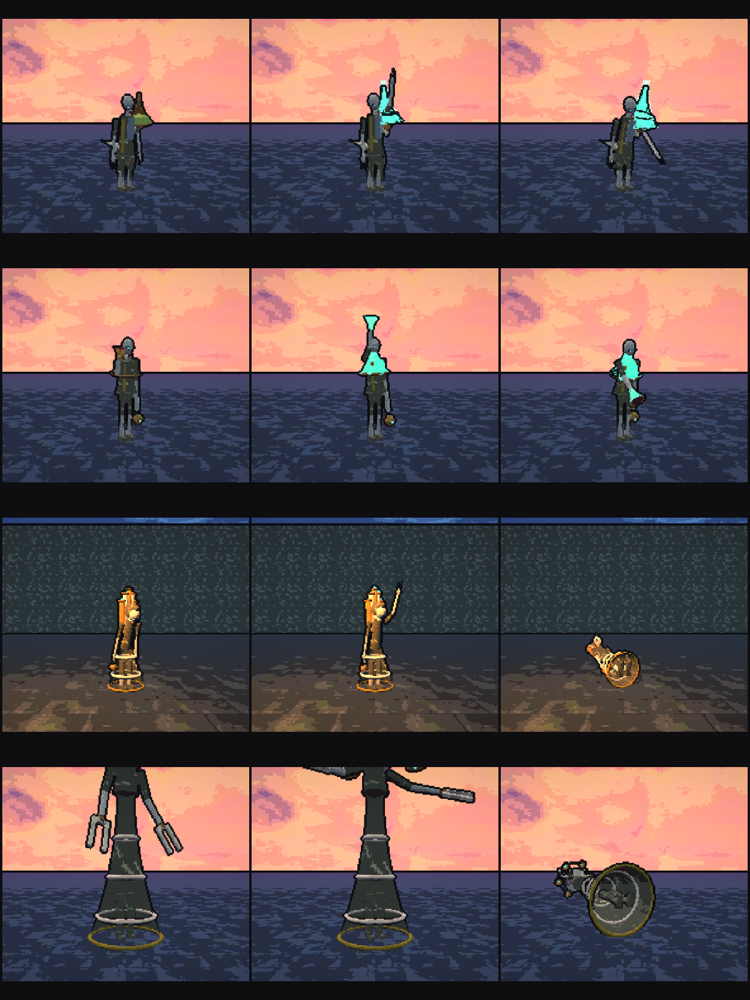
*Rows: Tollbearer, Bellhand, Sexton, Cantor; columns: idle, the tell, the strike (the Sexton and Cantor: the tell, then death).* The Tollbearer's bell swells and glows teal as its arm rises; the Bellhand raises its bell overhead and swings it down. Every tell keeps the shipped timing (the same `attack` values drive it); only the body changes.

A/B, Episode 1 dusk look (left of each pair: shipped; right: refined):
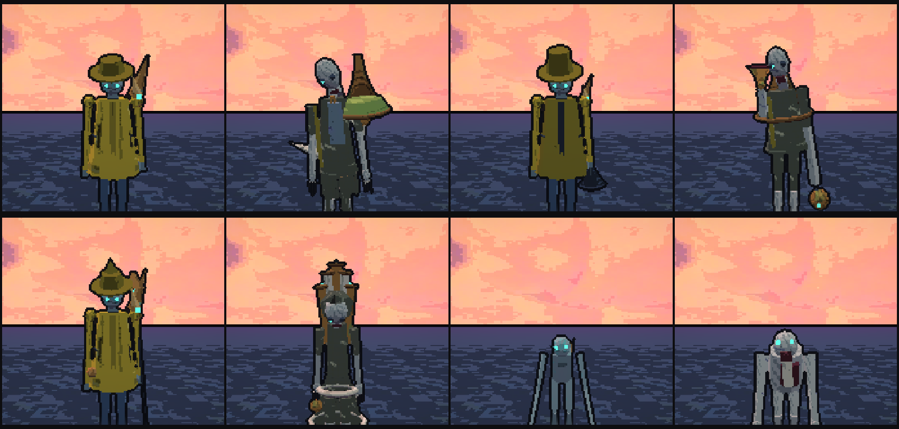
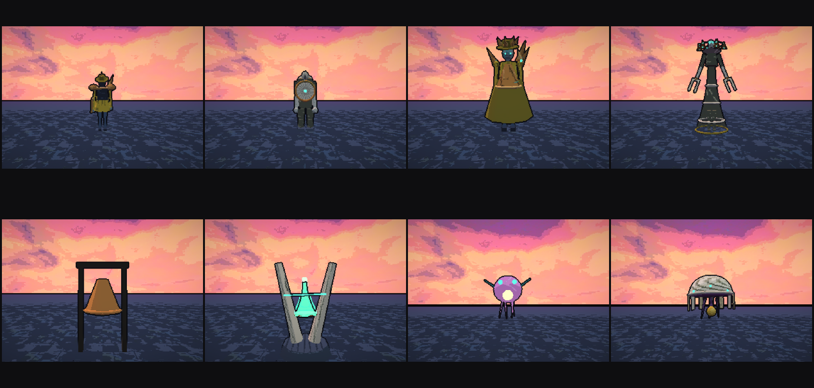
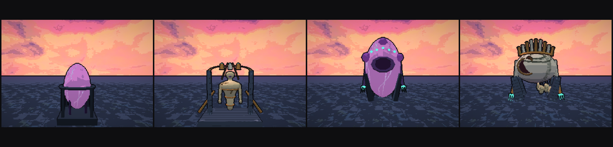

A/B, Episode 2 interior look:
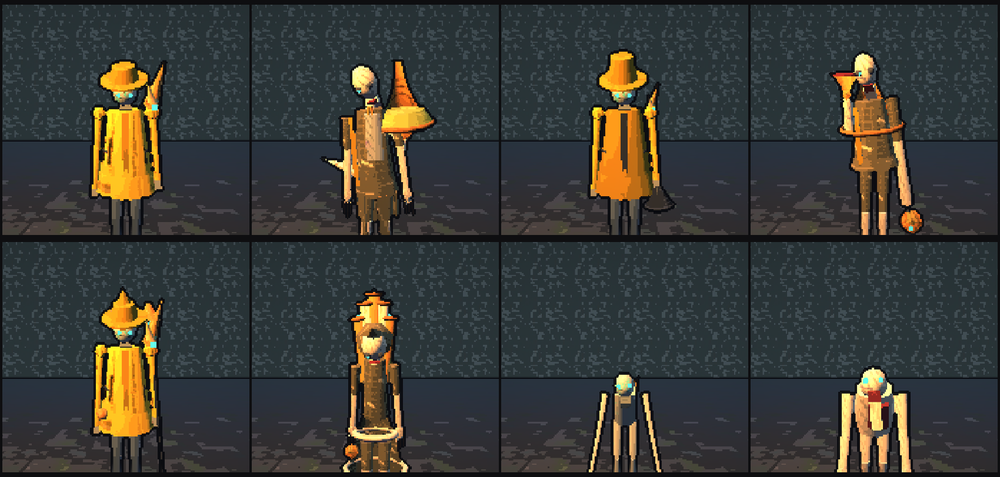
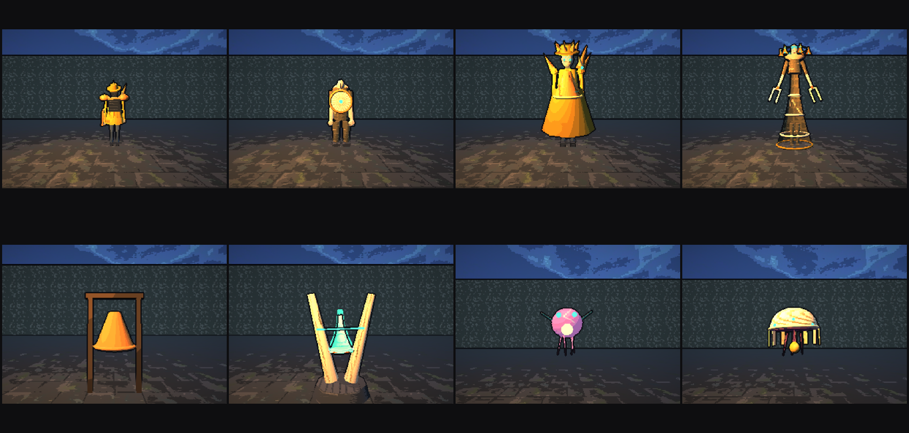
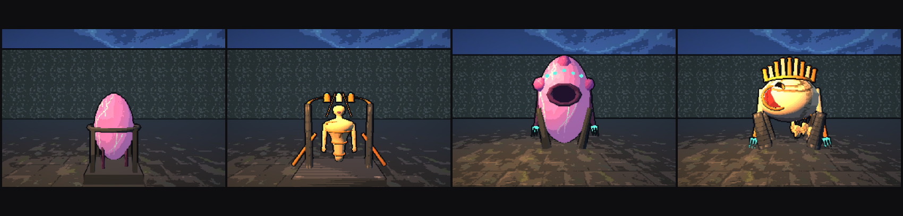

To scale, 10 m away (refined, then shipped):
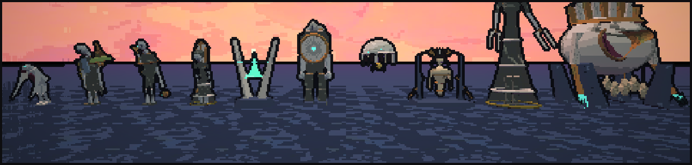
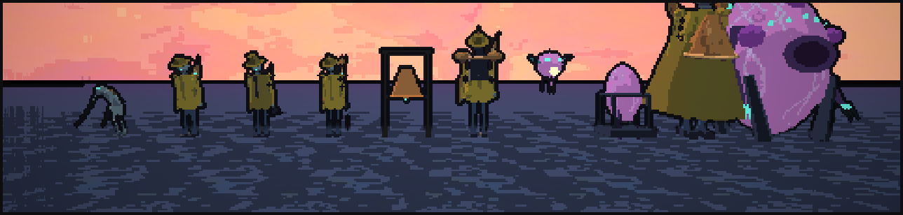

## B5. What the real renders taught (so the next rig starts here)

- **A mark thinner than about 1.2 px or closer than about 6 px to the next is lost** at 480 px width. The first atlas's hairline engraving was invisible; the atlas is now bold (1.1-1.8 px strokes, 6-8 px spacing). Fine line-work cannot carry the "engraved" look at fighting distance; value shapes and silhouette must.
- **Verdigris painted green-teal reads as the Hush under the game's cool light.** It is olive-yellow now. Teal is reserved for the Hush: the only teal on a body is an eye, a clapper, a ring, a tell.
- **Flat card-like panels read as paper labels.** The chest panel and the first feeder face were removed.
- **The width rule counts every vertex, including invisible ones.** A detail-1 icosphere is 240 vertices (non-indexed) and an echo shell duplicates its source; both dragged rigs out of the hit cylinder until they were made cheap (detail-0 hands, low-poly echo shells). A stooped posture shifts the head forward of the feet and the cylinder is centred on the feet, so stoop is limited.
- **My look-dev lamp sat inside the creatures** (a point light at the origin) and lit their feet from within: every early render was misleading. Hung from the ceiling now.
- **An upright 2.3 m figure cannot be silhouette-distinct from another by shape alone inside a 0.4 m hit radius** (B2).

## B6. What is NOT proven

Texturing at production quality (the atlas is a prototype; surfaces are flat colour with bold engraving); animation beyond the poses shown (walk, tell, death were looked at as stills, no clip was watched); any gameplay or balance; frame time; how the creatures look in the actual maps (only a dusk and a lamp-lit hall test set); whether they are "different from anything else out there" (I did not survey other games). The Warden and the feeder are the weakest designs; the bell node and Cantor the strongest.

## B7. What shipping this would take (L1, NOT started; the owner decides)

New: `src/render/models_choir.js` (the rigs and the kit, moved from `tools/look`), `tools/baker/recipes_choir.js` + `assets/baked/choir_atlas.png` (the atlas recipe moved and baked into the manifest), the atlas name in `src/render/textures.js` `FIXED`. Edited: the `ENEMY_MODELS` table in `src/render/view.js`; the `RIGS` lists in `tests/hit-volume-fair.test.js`, `tests/rig-grounding.test.js`, `tests/entityflag.test.js`, `tests/enemy-hit-volume.test.js`, `tools/dev/measure-rig.mjs`. Unchanged by design: `src/engine/*` (no hit volume moves), `src/render/post.js`, audio, maps, routes. Cost: `src/render` and `assets` change, so the real-game evidence of all 18 maps is regenerated ONCE (about the usual hour), from a clean commit, then pushed; the existing hit-volume, grounding and census tests are the gate and need no new thresholds.

## B8. Decisions for the owner

1. **The three humanoids (B2):** accept 0.50-0.54 overlap, or give one of them a different hit volume (an engine change)? Or separate them by colour (next)?
2. **Colour:** yellow is retired, so the humanoids are all grey-olive. A stronger hue per kind (Bellhand bronze/rust, Sexton ivory/violet, Tollbearer oxblood) is cheap and would do more for at-a-glance separation than any shape change. Yes?
3. **Cost:** about 1.2x-2.5x the triangles and more draw calls for the non-humanoids (B1). Acceptable, or trim detail first?
4. **The weakest designs:** redo the Warden-Graft and the feeder now, or ship them as they are?
5. **Go to L1** (put them in the game, all ten or the Tollbearer, Gill and feeder first, as the plan said) once these are answered?

---

# PART A: the first pass (drawn studies)


Why this exists: `assessment.md` found the renderer's painted/ink language is good and the content drawn through it is generic. The owner's brief (2026-10-06): *"distinct enemies ... things that look different than anything else out there ... keep the art style."* Their decisions: **everything is an instrument**; humans keep **dark torn oilskin**; tone **escalates by episode**; **look only first** (same ten kinds, same behaviours, same hit volumes).

**What this document is not.** These are flat front-view design studies, not game renders. They prove silhouettes, families and rules; they do not prove how the 3D rigs, the 480-pixel frame or the ink/banding post pass will treat them; that is L1. Whether any of it is "different from anything else out there" is a design intent, not something I have verified: I did not survey other games. What I can say is that every choice below is derived from this game's own premise (the Hush, bells, cradles, grafting), which is what keeps it from being the generic zombie/alien kit.

---

## 1. The grammar (six rules every creature, prop and surface is checked against)

1. **Form follows instrument.** A silhouette is an abstracted instrument family: BELL, PIPE, CLAPPER, DRUM/SHELL, TINE/FORK, GLASS-BELL, SAC. Distinct enemies come from distinct families, never from a hat on the same body.
2. **Horror is being tuned.** A human is stretched, pale, drum-tight; the oilskin hangs off as dark rags; bell-chitin and bone grow from the shoulder and spine; cables run from the jaw into the chest; the mouth is held open as a resonator. The *stage* of the graft rises with the episode: same family, more instrument.
3. **The Vael are the singers, not the instruments.** Grown, translucent, vertically symmetric: a glass-bell jelly with a tine fringe, an organ-bodied mother, a cradle sac with a person inside (not an egg).
4. **Motion is vibration.** Things that sing *ring*: the outline repeats in the Hush colour, drifting (the teal echo outlines in the studies). An attack tell is the ring doubling. Hordes sway to one shared Hush clock (render-only; the sim is untouched).
5. **Surface is engraving.** Baked line-work that reads as scrimshaw: ivory and bone with inked lines whose density follows the light, nodal (Chladni) figures instead of random cracks, verdigris on bronze. Ink outline, paper grain and value banding stay exactly as approved.
6. **Colour has meaning.** **Teal is the Hush: the Vael's voice only** (rings, eyes, energy). **Yellow is survivors and lamplight**, never an enemy. Bodies are bone, verdigris-bronze, bruise-violet, oxblood, oilskin-dark.

**Legibility rule (measured from the renderer).** Internal width 480 px, vertical FOV 70 degrees: about 32 px per metre at 6 m and 16 px per metre at 12 m. A 15 cm part is **4.8 px wide at 6 m and 2.4 px at 12 m**. So every silhouette-*defining* mass (bell, pipes, tines, drum, fringe) is at least ~15 cm; limbs may be thinner; engraving and nodal line-work (5 cm spacing) are **close-range detail only**: at 6 m they are 1-2 px and will not read. At distance the player sees silhouette, 2-3 value bands and the teal marks. The designs are made to carry on exactly that.

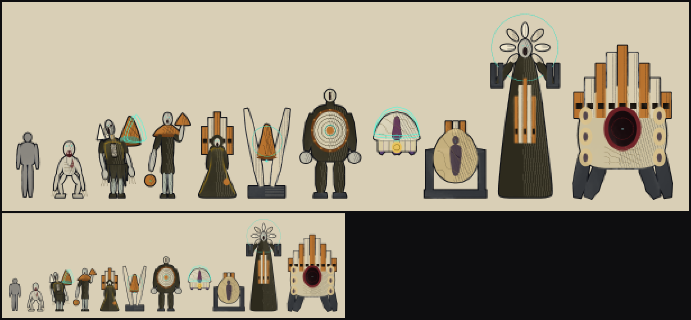
*Top: the ten creatures at 6 m, bottom: 12 m, at the game's pixel density, nearest-neighbour. The first figure is a roughly 1.8 m reference human. All ten stay distinct at 6 m; at 12 m the large ones read at once and the small ones (Gaunt, Gill) shrink but keep their family shape.*

---

## 2. The roster

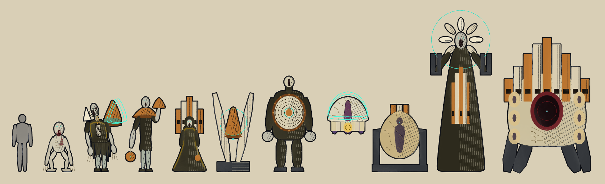
*To scale, left to right: reference human, Gaunt, Tollbearer, Bellhand, Sexton, bell node, Warden-Graft, Drone-Gill (hovering), cradle feeder, Cantor, Graft-Mother. Heights match the simulation's `defs.js` heights (checked: `node tools/look/check-figures.mjs`, all within +-0.10 m).*

Each entry: what it is, the tell the player sees, what changes by episode, how it must be built to stay fair. Hit volumes (`height`, `hitRadius`, `hitForward`) are **unchanged**; the drawn body must sit inside them. Arms, bells and trailing cloth that stick out past the torso are deliberately not hittable (the existing fairness rule).

### 2.1 Tollbearer: BELL (the zombie)
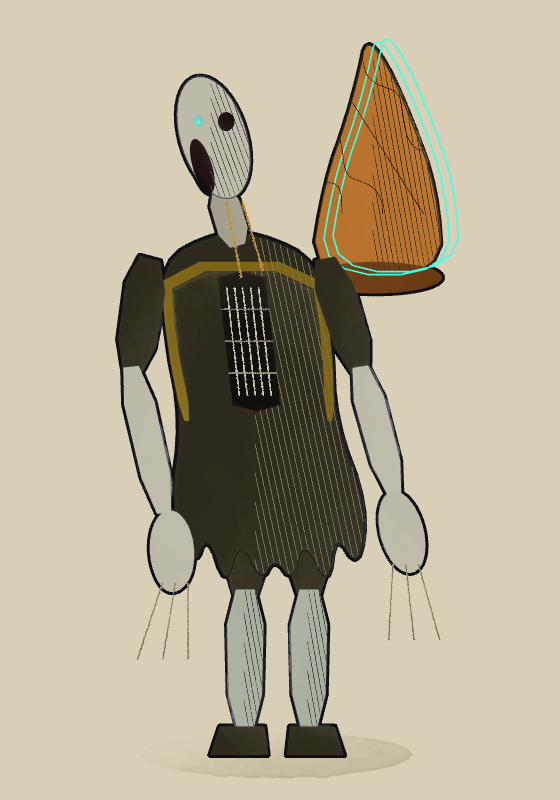 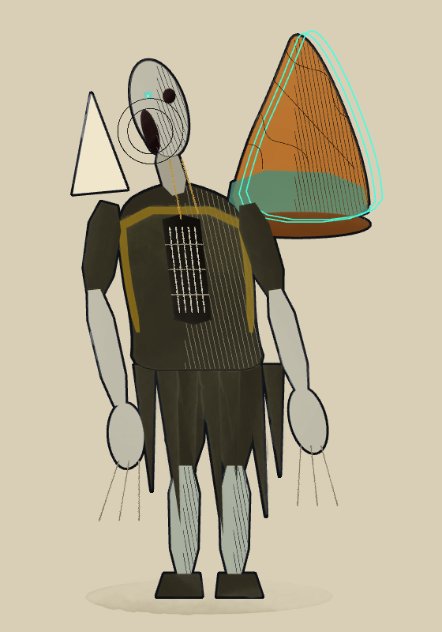
*Left: early graft (Episode 1). Right: grown (Episode 2+).*
- **Identity.** A person bowed under a bronze bell that grows from the right shoulder like a satchel; the body leans away from the weight. Head tilted as if listening, mouth slack and open (it is a resonator), one cold-teal eye point, grown cables running from the jaw into the chest, ribs showing as strings. Dark sodden oilskin; yellow survives only as a trim remnant. Grown stage: verdigris at the bell's lip, a bone vane on the other shoulder, the coat hanging in strips (the strings of the instrument).
- **Tell.** The bell swells and its teal outline doubles (replaces today's arm-raise glow; the arm-raise and its timing stay).
- **Death.** The bell rings once as it falls and the echo outlines fade; the body stays (L3: bodies that stay).
- **Why it is distinct.** The only lopsided, top-heavy figure in the roster: nothing else has a mass hung off one shoulder.

### 2.2 Gaunt Runner: UNTUNED (the screamer)
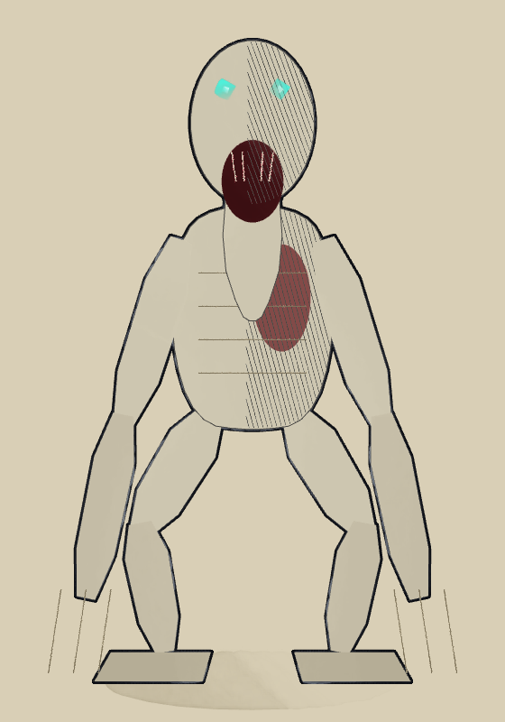
- **Identity.** Stripped, pale, no instrument yet: too-long limbs, bone claws, and the jaw come off its hinge into a red horn. The only creature that is *not* being tuned: it screams instead. Low and wide (a runner), so it never competes with the upright human forms.
- **Tell.** Crouch, the jaw opens wider, the throat reddens (the existing crouch-then-dash timing).
- **Note.** 48% of its silhouette is thinner than 15 cm (spindly by design); the claws are texture, not geometry, in L1.

### 2.3 Bellhand: CLAPPER
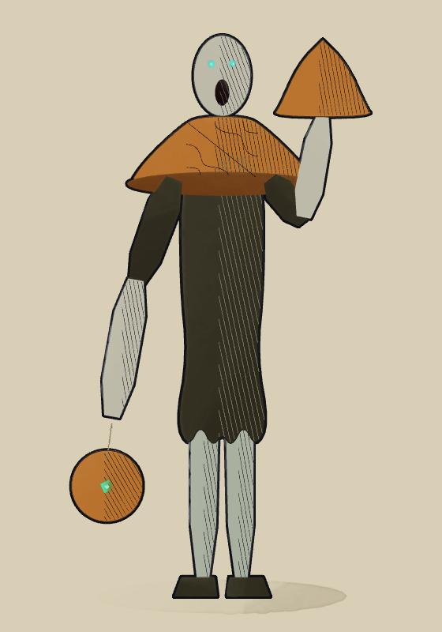
- **Identity.** A collar-bell on the shoulders; one arm has grown long and hangs to the knee ending in a bronze clapper; the other raises a bronze cup like a hand-bell. Lopsided in two directions at once.
- **Tell.** The cup arm rises and its outline doubles; the clapper swings (the ranged toll-shot timing is unchanged).

### 2.4 Sexton: PIPE
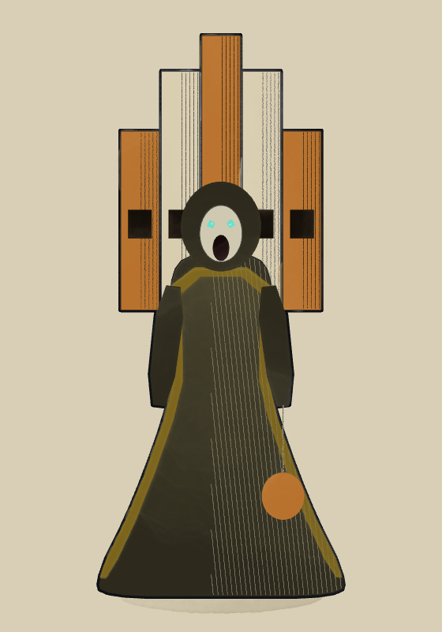
- **Identity.** Stooped: the hooded head hangs low, and a comb of five pipes rises from the back above it. The robe is a bell-skirt to the floor. A top-wide, waisted, bottom-wide shape.
- **Tell.** The pipes light in sequence along the channel beam (the existing channel-over-a-corpse mechanic, now visible on the body).

### 2.5 Warden-Graft: DRUM/SHELL
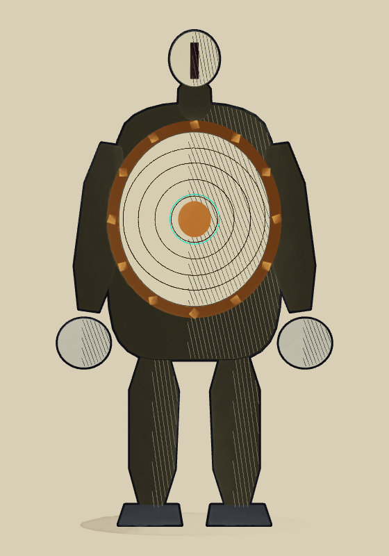
- **Identity.** A hulk with a grown drum-shell on its chest, concentric ring engraving and bronze lugs, a faceless bone plate for a head, and drum-sized fists. The plate that takes a third damage from the front *is* the drum.
- **Tell.** The shoulder drops and the drum's teal ring thickens before the charge.
- **Note.** The drawn width (1.66 m with the fists) exceeds the hit cylinder (1.25 m): the fists are the unhittable part, as in the existing rig.

### 2.6 Cantor (boss): CHOIR-MASTER
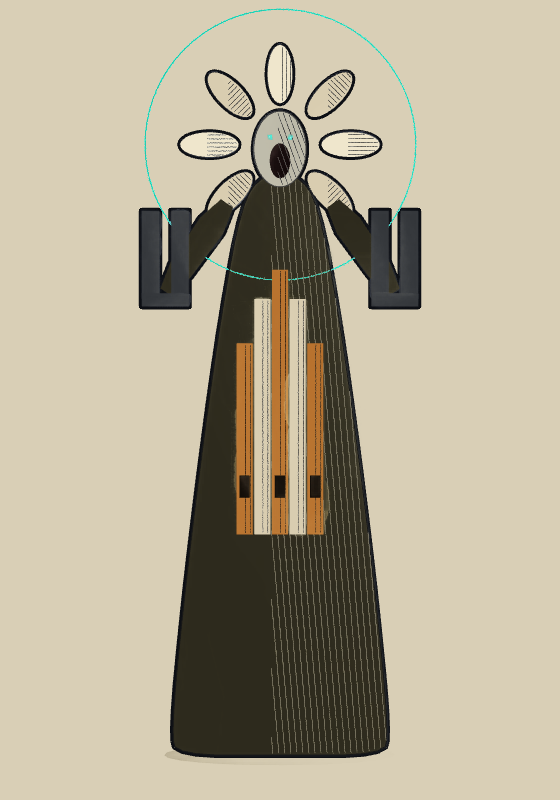
- **Identity.** A tall bell-robe with a rank of pipes on the chest, a halo of eight resonator petals round a small human face, two fork-bearing arms, 4.8 m. It reads as a vertical *organ* standing up, not a gown.
- **Tell.** Petals open outward; the halo ring expands (the pulse).

### 2.7 Bell node: RESONATOR
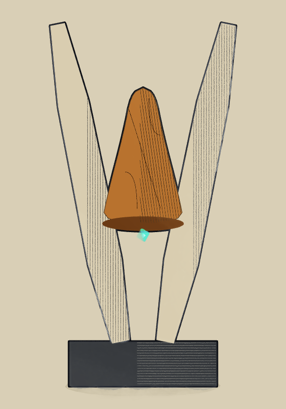
- **Identity.** A bell floating between the tines of a tuning fork struck into the ground: no cord, no gallows. The ring beam runs through it.

### 2.8 Drone-Gill: GLASS-BELL (the first non-human)
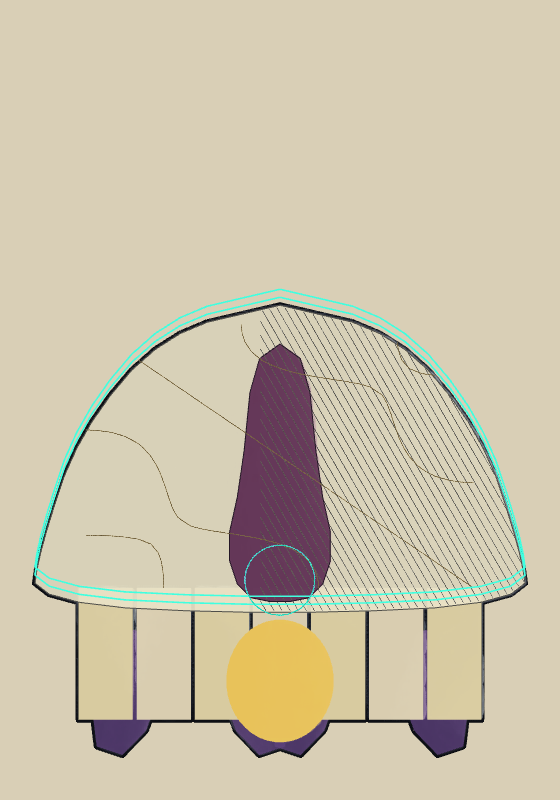
- **Identity.** A translucent bell mantle with a hanging heart-clapper, a fringe of seven chunky tines, and a glowing note-bubble spore sac. Hovers 1.2 m. It is a jellyfish by shape and a bell by logic; the teal echo outlines trail the mantle as it flies.
- **Tell.** The tines vibrate faster and the sac swells (the existing spit windup).
- **Build note.** Translucency needs a blended material; blended meshes are left out of entity marking (see `src/render/entityflag.js`).

### 2.9 Cradle feeder: SAC
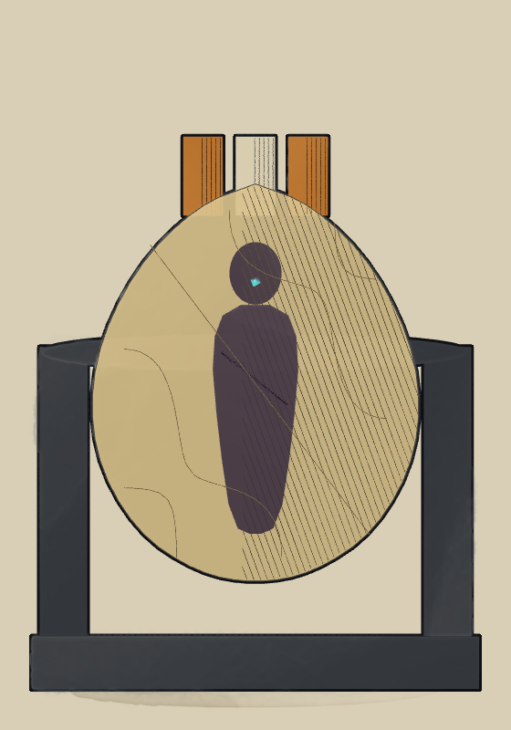
- **Identity.** A membrane sac hung in an iron rack under three pipes, **with a person inside**, curled. This puts the premise's best image on screen: the horror was in the text and not the pixels.
- **Tell.** The sac pulses and the nodal pattern brightens while it feeds the mother.

### 2.10 Graft-Mother (boss): PIPE-ORGAN BODY
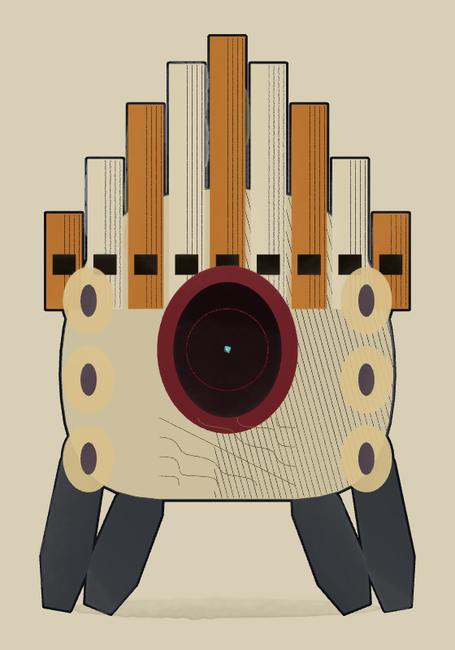
- **Identity.** Nine ranks of pipes over a case with a dark oxblood throat, cradle racks as her ribs and legs, six sacs down the flanks. She is a room-sized instrument. Her shield is a **resonance field** (concentric standing-wave rings that open like petals), not today's wireframe ball.
- **Tell.** The pipes fire in sequence; the rings widen.

### 2.11 Silhouette overlap (the L0 acceptance test)
Measured on flat black silhouettes at true scale, same distance, feet aligned (`node tools/look/sil-matrix.mjs`; intersection over union of the pixels):

| | today (assessment) | designs |
|---|---|---|
| Tollbearer / Sexton | 0.87 | **0.46** |
| Tollbearer / Bellhand | 0.82 | **0.42** |
| Bellhand / Sexton | 0.79 | **0.44** |
| worst pair of any two game kinds | 0.87 | **0.49** (bell node / Sexton) |
| target | | < 0.50 |

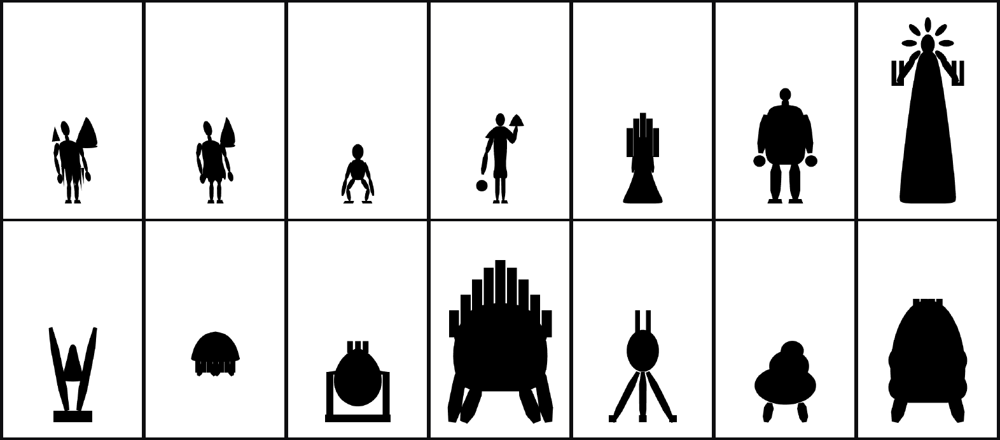
*Row 1: Tollbearer (grown), Tollbearer (early), Gaunt, Bellhand, Sexton, Warden-Graft, Cantor. Row 2: bell node, Drone-Gill, feeder, Graft-Mother, then three Episode 3 sketches.*

**Honest reading of this number.** I iterated the shapes until the metric passed, so it proves *these studies* are distinct at equal scale, not that the finished 3D rigs will be. Under the stricter *shape-only* reading (each scaled to the same height) the worst pair is Cantor / Sexton at 0.69, because both are tall robes with pipes; in the game they differ by a factor of two in size, but they DO share a map (C1E1M08, the Cantor's arena also holds Sextons, a Warden-Graft and the bell nodes), so it is the weakest pair that actually meets, and I would redraw one of them if you want it fixed now. The thin-feature numbers (share of the silhouette thinner than 15 cm): Tollbearer 35%, Gaunt 48%, Bellhand 31% (these are limbs, tatters and claws, which become texture in L1), all other kinds under 12%.

---

## 3. Surfaces

Six material families, each drawn by a **different generator** (this is the point: today's 28 textures share one recipe of blotches, scratches and rivets):

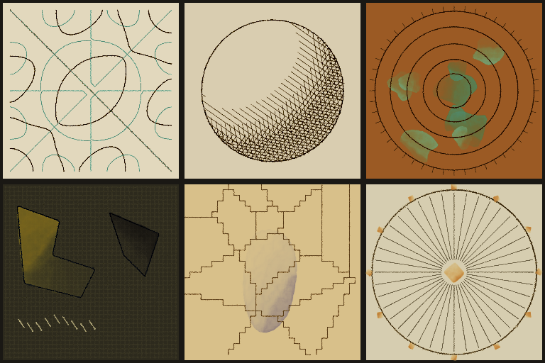
*Top row: nodal plate; engraved bone; verdigris bronze. Bottom row: oilskin remnant; membrane; drum-skin.*

| family | generator in the study | used for |
|---|---|---|
| **Nodal plate** | marching squares over cos(n pi x)cos(m pi y) - cos(m pi x)cos(n pi y) = 0: real Chladni nodal lines | Vael walls and instruments; bells' faces; the pattern that brightens when a thing feeds or sings |
| **Engraved bone** | hatch passes whose density follows a lighting function (the line-work *is* the shading) | bone vanes, jaws, skin on bodies, pipes |
| **Verdigris bronze** | irregular patina patches over bronze plus concentric engraved rings and rim ticks | bell-chitin, collars, drum lugs, clappers |
| **Oilskin remnant** | woven grid, torn polygons, stitched edge, a yellow remnant | human coats (dark; yellow only as trim) |
| **Membrane** | veined cells | cradle sacs, Vael walls, the gill's mantle |
| **Drum-skin** | radial tension lines to a hoop with lugs, one teal ring | the Warden's drum, drums in rooms |

**Limits of this study.** These are single swatches, **not tileable 256 px game textures**; the membrane's vein network is visibly stepped because I found the cells on a coarse grid (L1 would use a proper Voronoi or warped cells); and at game scale only the large-scale value and colour survive (see the legibility rule). Making them real, tiling, painted-in-brush textures is L1/L2 work. The recipes in `tools/look/recipes_look.js` are the starting point, not the end.

### The alien room kit (set dressing; render only; the sim stays a grid)
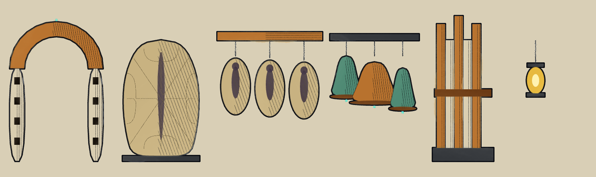
*Left to right: pipe-rib arch; membrane wall panel; a chain of three cradle sacs; a cluster of resonator bells; a pipe column; the lantern.*
The sim's rooms stay rectangles; these dress them: ribbed arches across ceilings, bulging membrane panels on walls, hanging cradle chains, bell clusters, pipe columns that read as load-bearing. Rules: cladding stays inside the cell or wall thickness (the render-truth census and hit-volume tests must pass); and **the lantern shows the colour rule**: warm yellow is a survivor or a lamp, never an enemy. This is a menu of shapes, not a map layout; no map is changed.

---

## 4. Colour script and tone, by episode

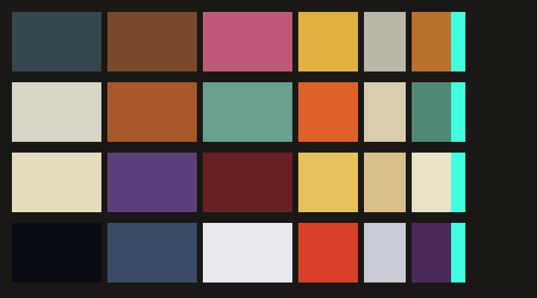
*Rows: Episodes 1-4. Columns: three hues, the accent (a lamp or ember or sulphur), the body colours, and the narrow teal strip: the Hush.*

| episode | tone | hues | accent | graft stage and what the player sees |
|---|---|---|---|---|
| **1 Port Marrow** | **Eerie.** The wrongness is quiet: stillness, humming, a bell where a shoulder should be. No exposed tissue. | slate, brick, dusk-rose | lamp yellow | **Stage 0**: a small bell, the person still mostly intact |
| **2 The Salt Works** | **Uncanny-industrial.** The process is visible: rails, rigs, cradles holding people. First Vael (the gill). | bleached salt, rust, chemical green | ember orange | **Stage 1-2**: grown bell, verdigris, bone vanes, the coat in strips |
| **3 The Choir Ships** | **Alien.** The Vael themselves; membranes and nodal figures on every surface; things visibly vibrate. | ivory, violet, oxblood | sulphur | **Stage 3**: fully grown, little left of the person but the face; the pipes and drums are the body |
| **4 The Hollow Sky** | **Visceral and cold.** The choir is a body: wet oxblood interiors, lacquer highlights, exposed resonance. | black, cold steel, bone-white | vermilion | **Stage 3 + wounds**: the same families, now bleeding |

Only stages 0 and 2 are drawn (the two ends of the Episode 1-2 range); 1 and 3 are described, not drawn. The default sky stops being the pink-orange dusk: dusk is Episode 1's, earned, and the others take their own.

---

## 5. Motion language (render-only, deterministic, free for the sim)

- **Hush clock.** One shared render-time clock (not the sim's RNG and not per-enemy randomness) drives the sway of idle hordes in unison and the tempo of every Vael light. Enemies that are asleep are merged into one mesh by `view.js`: ring ghosts must be hidden while idle so the merge still works.
- **Echo outlines.** A part's outline repeated 2-3 times, offset, in teal at low alpha: the "this one sings" read. Blended, so left out of entity marking.
- **Attack tells.** Keep every existing windup and its timing (the sim's tells do not move); change only what the body does *during* them: the bell swells, the pipes light in sequence, the drum ring thickens, the halo opens.
- **Grounding.** All rigs keep the existing contract (`ground-contract.js`: the view owns `root`, `pose()` writes only `rig`, `makeRigGrounder` lifts the lowest vertex): nothing here needs it changed.

---

## 6. Episode 3 sketches (silhouette level only; NOT built, NOT in the game)

Row 2 of the silhouette sheet: **Chorister** (a tuning-fork tripod under a glass dome: suppression and flanking), **Bulwark Shell** (a conch carapace on short legs: the shield-bearer), **Weeping Mother** (an organ throne hung with cradle sacs: the elite mother). They are here so the first ten are not designed in isolation. Two overlaps to fix when Episode 3 is designed: Bulwark / feeder 0.62 and Weeping Mother / Graft-Mother 0.53 in place.

---

## 7. Behaviour ideas (NOT proposed for this pass; listed so you can say yes or no later)

Your decision was look first. These are the ideas the instrument roles suggest; none is built or planned without a separate approval, and each would touch the sim and force re-verification:
- **Chorus coupling:** three or more Tollbearers swaying in unison inside 6 m amplify each other (area toll), so the horde's synchrony is a mechanic, not just a look.
- **Piper (Sexton variant):** its pipes sustain a tone that narrows the player's aim cone while in earshot.
- **Wire-weaver:** a tuned human that throws a snare line which pins the player for a second unless dodged.
- **Warden's drum-roll:** a floor ring that marks the charge lane during the windup (a readability change).
- **Cantor petals:** per-phase vulnerable petals instead of only the bell ring.

---

## 8. What I need from you (L0 decision)

Approve, revise or stop. If revise, the most useful answers:
1. **The Tollbearer:** is a bell hanging off one shoulder (lopsided, leaning) the right zombie? Or should the instrument grow from the centre of the back?
2. **The Gaunt:** is a pale screamer with the jaw off its hinge right, or should the runner also be tuned?
3. **The look of the studies:** these are clean, flat, inked shapes with engraved shading. Is that the painted language you want, or rougher and more brush-wet? (The game's post pass adds ink, banding and grain on top.)
4. **Cantor / Sexton** share a tall-robe-with-pipes read when scaled to the same height (0.69 shape-only), and they do meet in C1E1M08. Redraw one now?
5. **Cradles with people inside, from Episode 2:** comfortable with that level of content?
6. **Colour:** yellow survives only as trim on dark coats, and teal belongs to the Vael alone. Agreed?

## 9. What L1 will build and how it will be judged (after approval, not before)

L1 rebuilds three things end to end: the **Tollbearer** (stage 0 and stage 2, to prove the escalation), the **Drone-Gill**, and the **cradle** (a sac with a person inside), plus one real tiling material set and the echo and chorus-sway tech. Same shot list as `assessment.md`, before and after, same spots. Acceptance: hit-volume fairness, rig grounding, entity-flag, e2-roster and render tests pass with their thresholds unchanged; silhouette overlap against every other kind < 0.5 **measured on the built rigs, not the studies**; the render-truth census passes; render cost not worse than the baseline. Cost: it changes `src/render/` and `assets/`, which invalidates the real-game evidence of all 18 maps; I will batch so there is one full regeneration for L1, not one per tweak.

## 10. Reproduce

```
node tools/look/check-figures.mjs                 # drawn heights vs defs.js (plain Node)
node tools/look/bake-concepts.mjs [id ...]        # draw the studies into review/look-bible/ (headless Chrome, p5 + p5.brush)
node tools/look/sil-matrix.mjs                    # the overlap matrix + thin-feature loss (writes sil-matrix.json)
node tools/look/at-game-scale.mjs                 # the lineup at the game's pixel density
```
Data: `tools/look/figures.js` (the designs, in metres). Drawing: `tools/look/recipes_look.js`. Nothing here is a game asset.
